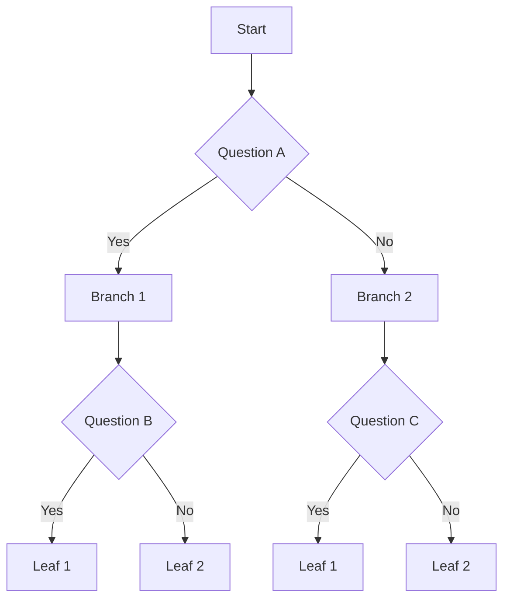

# Database Specialisation
Welcome to my JCore specialisation. In this repository you can find the progress I've made on the various goals I've 
set.

# Database types

1. Relational
2. Non-relational
   * Document
   * Key-value
   * Graph
   * Column family

# Database choices

1. Relational 
   1. PostgresSQL 
   2. MariaDB 
   3. Oracle

2. Non-relational
   1. MongoDB
   2. Elasticsearch
   3. Redis
   4. GraphQL
   5. Cassandra

# Decision tree

### Links
- [Mermaid editor](https://mermaid.live)

### Sources
- [Types of SQL databases](https://www.altexsoft.com/blog/business/comparing-database-management-systems-mysql-postgresql-mssql-server-mongodb-elasticsearch-and-others/)
- [Types of NoSQL databases](https://www.mongodb.com/scale/types-of-nosql-databases)
